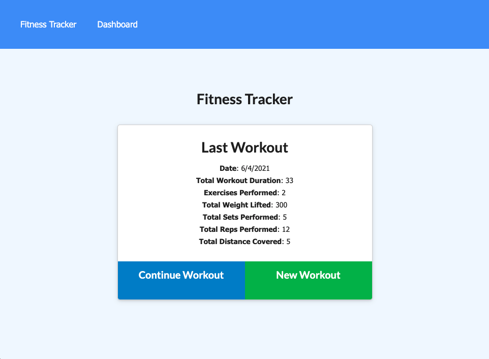

# Workout Tracker

## Table of Contents
- [Description](#description)
- [Installation](#installation)
- [Usage](#usage)
- [License](#license)
- [Questions](#questions)

## Description

Create daily cardio and resistance workouts and view your progress with helpful graphs.

## Installation Instructions

Application can be accessed online [here](#). 

## Usage

Create new workout and choose workout type. Complete workout to view the day's progress; continue workout to add more. Clicking Dahboard will show your stats from the last 7 days. 

## License 

This project is licensed under the MIT License. Click the link below to learn more about how you can use this project.  
License: [MIT License](https://opensource.org/licenses/MIT)

## Questions

* Github: [matthewxgoad](https://github.com/matthewxgoad)  
* Email: [matthewxgoad@gmail.com](mailto:matthewxgoad@gmail.com)
